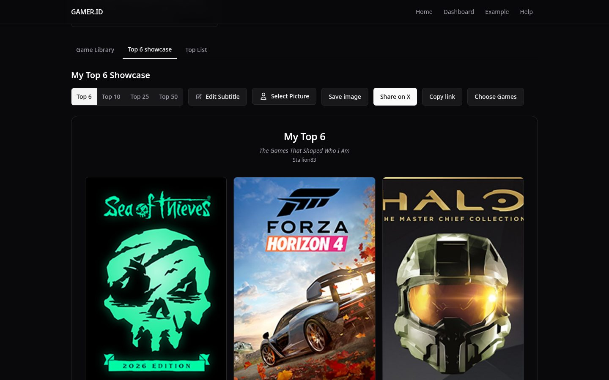
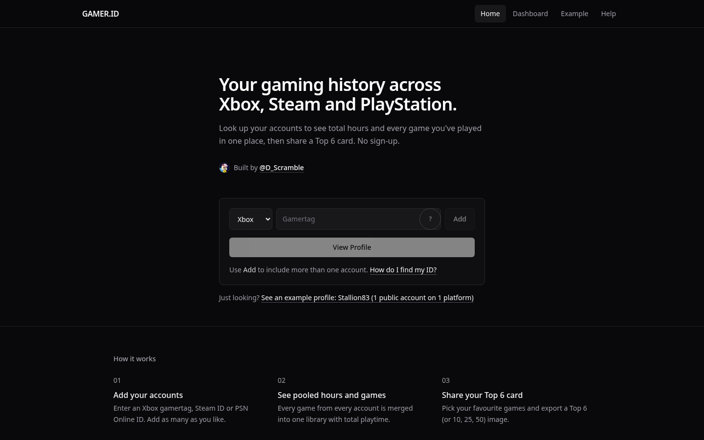
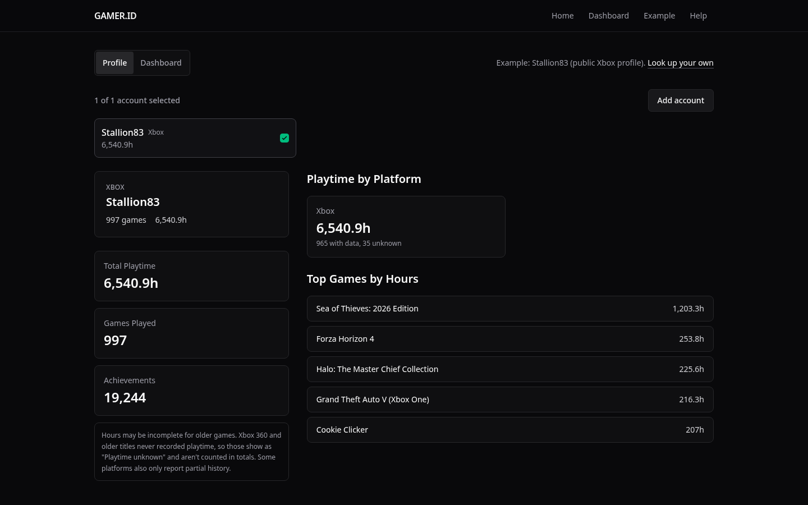
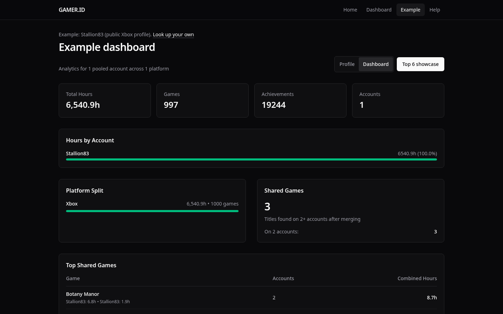
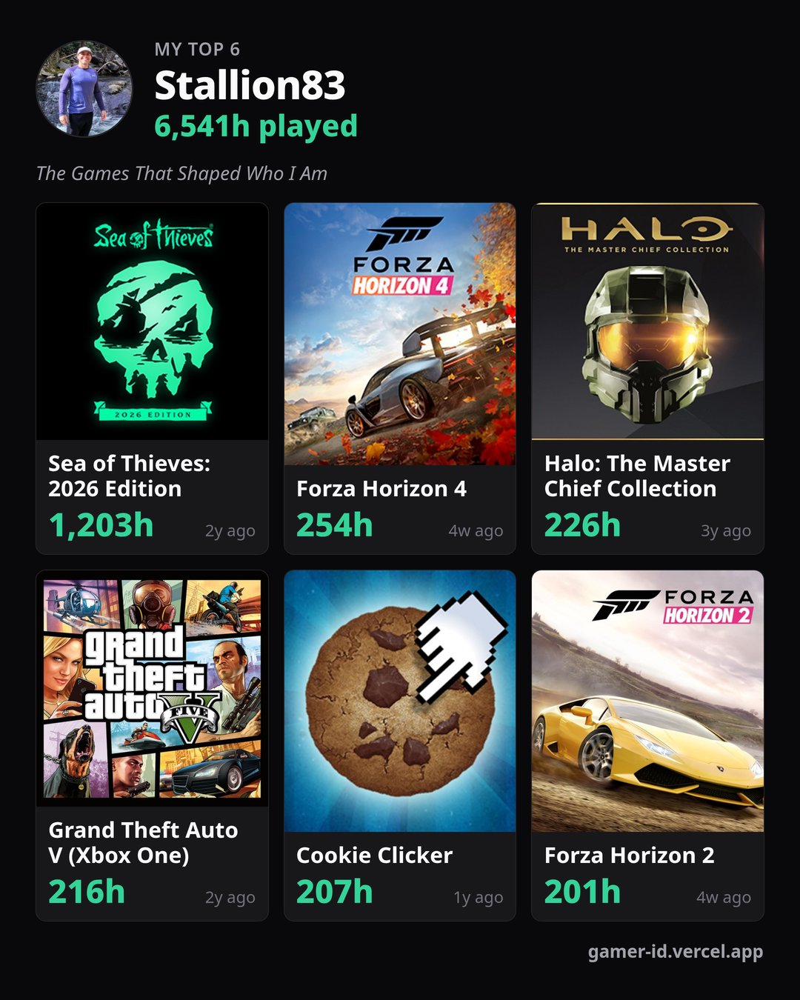
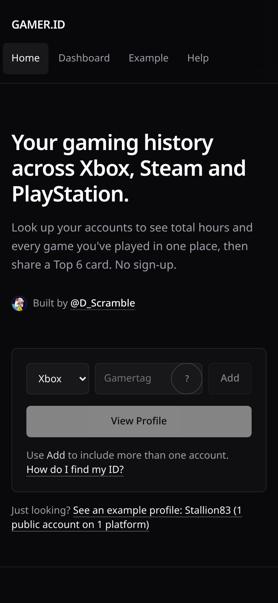
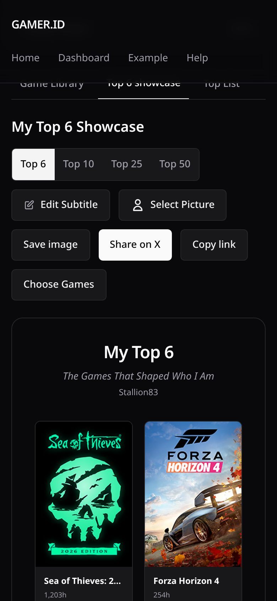
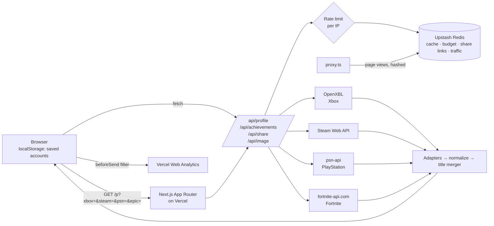

# GAMER.ID

**Your whole gaming history, Xbox, Steam, PlayStation and Fortnite, on one page you can share.**

**Live:** https://gamer-id.vercel.app · Try the example: https://gamer-id.vercel.app/p?xbox=Stallion83&example=1



## What it does

- **One profile across four platforms.** Enter an Xbox gamertag, a Steam ID/vanity URL, a PSN online ID and an Epic display name (any combination, up to 6 accounts). GAMER.ID pulls each library and merges the same game across platforms into one entry with combined playtime and achievements.
- **Fortnite stats (Epic).** Add an Epic display name to get a Fortnite card: hours, matches, wins, win %, kills, K/D and a solo/duo/squad breakdown, from [fortnite-api.com](https://fortnite-api.com) (unofficial). Fortnite also appears as a game ("Fortnite (Battle Royale stats)") in pooled hours and the Top N showcase; if the pool has Fortnite on Xbox/PlayStation too, the hours are counted once (the larger number), because Epic's stats already include console matches.
- **Game library.** Search, sort (last played, playtime, completion, title) and filter by platform. Large libraries are paginated so phones stay fast.
- **Top 6 / 10 / 25 / 50 showcase.** Pick your games, add a subtitle and profile picture, then save it as an image sized for X, copy a short link, or share it straight to X.
- **Dashboard.** Total hours, per-platform breakdown and your most-played games.
- **Short share links.** `/u/AbC123xy` restores the exact view (accounts, tab, showcase size).
- **Clear errors.** Private Steam profiles get step-by-step fixes, unknown gamertags are flagged inline, and if one platform is down the others still load.
- **No sign-up.** Saved accounts live in your browser's localStorage.

## Screenshots

| Home | Profile | Dashboard |
|---|---|---|
|  |  |  |

| Exported Top 6 image | Mobile home | Mobile Top 6 |
|---|---|---|
|  |  |  |

## Tech stack

- **Next.js 16** (App Router, Route Handlers, `proxy.ts`), **React 19**, **TypeScript**
- **Tailwind CSS v4**
- **Upstash Redis** (via the Vercel Marketplace) for rate limits, the shared OpenXBL budget, the profile cache, short links and a privacy-friendly traffic counter
- **Vercel** hosting plus Vercel Web Analytics
- **Xbox:** [OpenXBL](https://xbl.io) API
- **Steam:** Steam Web API
- **PlayStation:** [`psn-api`](https://github.com/achievements-app/psn-api) authenticated with an NPSSO token
- **Fortnite:** [fortnite-api.com](https://fortnite-api.com) Battle Royale stats (server-side key in the `Authorization` header, 15-minute cache, 600 lookups/hour global budget)
- **Vitest** + Testing Library; `html-to-image` for the showcase export

## Architecture



## Engineering highlights

- **Platform adapters behind one interface** (`lib/adapters`). Each platform returns the same `ApiResult` shape, and one platform failing never breaks the others. Errors are converted into safe, user-facing messages (`lib/utils/safe-error.ts`, `lib/account-errors.ts`).
- **Cross-platform title merging** (`lib/utils/title-merger.ts`). Titles are normalized (trademark symbols, punctuation, "The", editions) and an alias table handles series like Call of Duty, so a game owned on two platforms shows as one row with summed playtime and merged achievement progress.
- **Protecting a 150 request/hour upstream.** OpenXBL's free tier is shared by every visitor, so a global hourly budget in Redis (150 with a 20-request reserve) serves a friendly "Xbox is busy" state instead of failing. Identical in-flight requests are deduplicated and profiles are cached for an hour.
- **Per-IP rate limiting** in Redis by route family (profile 120/h, share 20/h, image 600/10 min), falling back to an in-memory store in local dev.
- **SSRF-safe image proxy** (`/api/image`). Host allowlist, and every redirect is followed manually and re-checked against the allowlist before it is requested. This also gives the canvas export same-origin images.
- **Reliable image export.** Images are fetched and decoded before the snapshot, the canvas is clamped to a pixel budget, and the output stays under X's 5 MB limit (PNG if it fits, otherwise high-quality JPEG).
- **PSN paging and tokens.** NPSSO → access/refresh tokens with an in-memory cache. Played games are paged at Sony's 200 maximum, and http avatar URLs are upgraded so the CSP (`img-src https:`) holds.
- **Short links.** 8-character codes, validated input (4 KB cap), deduplicated per canonical view, 5-year TTL.
- **Security headers and input validation.** CSP and friends in `next.config.ts`, strict validators for gamertags, Steam IDs and PSN IDs. See [docs/SECURITY_AUDIT.md](docs/SECURITY_AUDIT.md).
- **Accessibility and performance.** 0 axe-core violations (WCAG 2.2 AA + best practices) on every page. Lighthouse 100/100/100/100 on the home page (mobile and desktop) and 90–100 performance on the profile page. 44px tap targets, skip link, focus rings, reduced-motion support.

## Tests

```bash
npm test        # vitest run
```

**333 tests in 25 files** cover adapters (Xbox, Steam, PSN), title merging, playtime math, input normalization, rate limiting, route guards, the image proxy, share links, export layout, saved accounts, error mapping and the traffic counter filters.

## Run locally

```bash
git clone https://github.com/bigfishlaker/gamehistory.git
cd gamehistory
npm install
cp .env.example .env.local   # fill in the keys you have
npm run dev                  # http://localhost:3000
```

`.env.example` lists the variable names only: `OPENXBL_API_KEY`, `STEAM_API_KEY`, `PSN_NPSSO`, `UPSTASH_REDIS_REST_URL`, `UPSTASH_REDIS_REST_TOKEN`, `NEXT_PUBLIC_SITE_URL`, `TRAFFIC_SALT`, `TRAFFIC_EXCLUDE_IPS`. Each platform is optional; without Upstash the app uses an in-memory store.

Other scripts: `npm run lint`, `npx tsc --noEmit`, `node scripts/traffic.mjs` (prints the last 7 days of page views from Redis).

## Deploy

Deployed on Vercel (`vercel deploy --prod`). Add the env vars above in the Vercel project, and add "Upstash for Redis" from the Marketplace (it injects `KV_REST_API_URL` / `KV_REST_API_TOKEN`, which are also accepted). Details are in [docs/DEPLOY.md](docs/DEPLOY.md).

## Privacy

GAMER.ID has no accounts and sets no visitor cookies. Saved gamertags stay in your browser's localStorage. Traffic stats are anonymous: Vercel Web Analytics is cookieless, and the built-in page-view counter stores only daily totals, page paths, referrer hostnames and a salted, daily-rotating hash for unique visitors. Raw IP addresses are never stored, and counters expire after 90 days. See the in-app [privacy page](https://gamer-id.vercel.app/privacy).

## Docs

- [docs/BUILD_LOG.md](docs/BUILD_LOG.md): how this was built in one day
- [docs/SECURITY_AUDIT.md](docs/SECURITY_AUDIT.md)
- [docs/DEPLOY.md](docs/DEPLOY.md)

---

Built by [@D_Scramble](https://x.com/D_Scramble)
